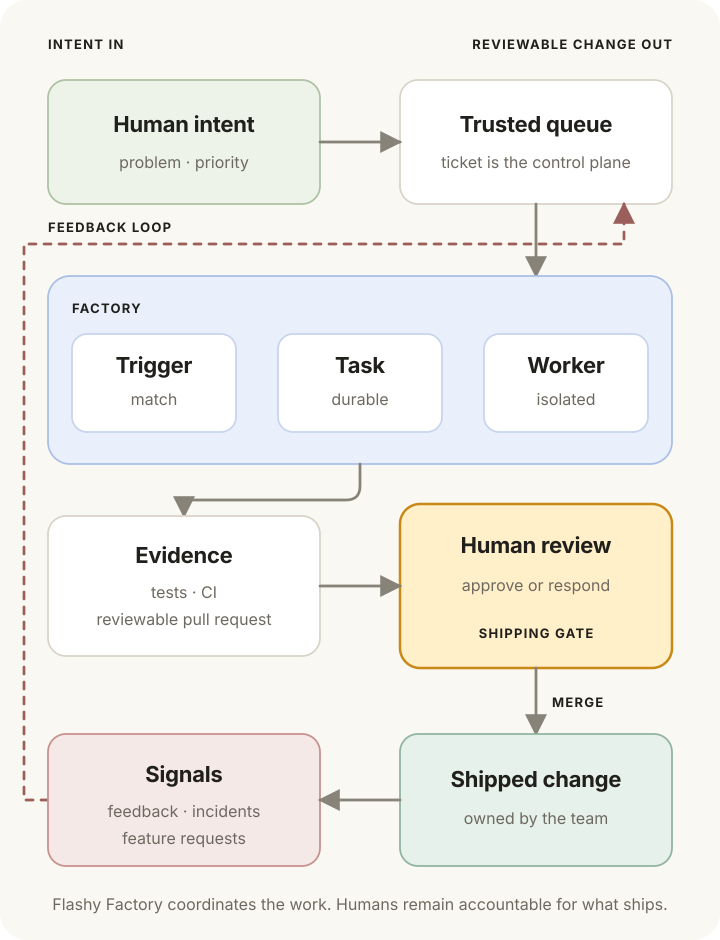
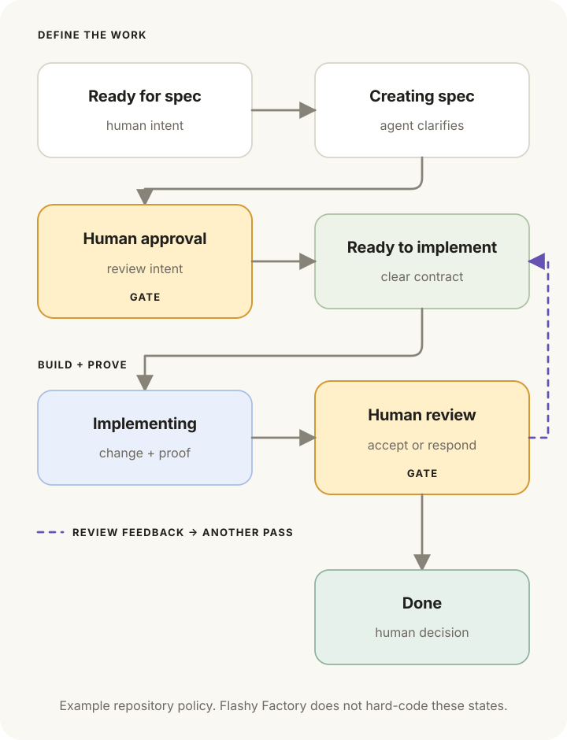

# Flashy Factory

[](https://github.com/fatherflash/flashy-factory/actions/workflows/ci.yml)
[](LICENSE)

Flashy Factory keeps coding agents working on a repository without making a
human orchestrate every step from a terminal.

It watches a trusted Asana task queue. When a configured condition matches,
Flashy Factory creates a durable local task, prepares an isolated workspace,
and gives one Markdown workflow to an agent. The agent uses the repository's
Asana client plus Git, and the configured repository host CLI: `gh` for
GitHub or `glab` for GitLab.com. When nothing matches,
Flashy Factory does nothing and spends no model tokens.



## Why Flashy Factory exists

Coding agents can implement increasingly substantial changes, but most teams
still operate them as one-off terminal sessions. Every developer uses different
prompts, skills, checks, and handoff conventions. Humans remain responsible for
noticing ready work, starting an agent, waiting for CI, forwarding review
feedback, and remembering to try again.

Flashy Factory makes this process repeatable. It plays a similar role to CI/CD:
work enters a consistent system, receives the same checks and feedback loops,
and keeps moving until it reaches a human decision.

The goal is not to replace developers. Humans decide what matters, supply
product context, review the result, and remain accountable for what ships.
Flashy Factory removes the manual coordination between those decisions.

## The ticket is the control plane

The issue tracker is where humans and agents coordinate. A ticket records the
problem, scope, acceptance criteria, decisions, status, and evidence. Moving a
ticket into a configured state is an explicit request for an agent pass.

This makes ticket quality load-bearing. A vague ticket is not ready for either a
human or an agent. A triage workflow can inspect the codebase, reproduce the
problem, clarify scope, add testable acceptance criteria, and ask for the
smallest missing human decision. Once the ticket is clear, it becomes the spec
for implementation.



The status names in this example are not built into Flashy Factory. In this
fork, they are ordinary Asana project sections and repository-owned prompts.
Moving a task into a configured section is the human authorization boundary.

## A deliberately small model

Flashy Factory has four concepts:

| Concept | Responsibility |
| --- | --- |
| Source | The ticket queue and control plane. Asana in this fork. |
| Trigger | A status, label, or schedule condition. |
| Workflow | A plain Markdown prompt describing the outcome and policy. |
| Worker | The agent runtime, sandbox, timeout, and concurrency limit. |

The boundary is intentional:

- Flashy Factory owns polling, trust checks, deduplication, durable claims,
  concurrency, timeouts, sandbox lifecycle, supervision, cancellation, history,
  and recovery.
- The workflow and agent own adaptive engineering work: reading the issue,
  inspecting code, clarifying requirements, implementing changes, using Git and
  the configured repository host CLI, opening a change request, responding to
  CI and review, and updating the ticket.

Flashy Factory does not encode a fixed SDLC, a workflow graph, or deterministic
tracker effects. A trigger means only: **when this condition is true, run this
prompt**.

## Human review is the shipping boundary

Flashy Factory revalidates live source state immediately before execution, but
does not filter tasks by author. The trust boundary is whoever can move a task
into a configured Asana section or apply a required tag. Do not allow untrusted
people to satisfy those conditions. Task notes, comments, linked change requests,
and attachments remain untrusted input regardless. Use narrow credentials and
protected branches that the worker cannot bypass.

Flashy Factory-created software change requests remain for human review. Flashy
Factory and its default workflows never merge them or enable automatic merge.
The human who merges remains accountable for what ships.

For the complete trust and isolation model, read the
[operations guide](docs/operations.md) and [security policy](SECURITY.md).

## Get started

Flashy Factory is a Rust CLI named `factory`. You can either work on Flashy
Factory itself or install it and use it to manage another repository.

### Prerequisites

Install these tools on a Unix-like host:

- Python 3
- a current stable Rust toolchain
- Git
- the GitHub CLI for GitHub repositories or GitHub-backed ticket sources
- the GitLab CLI for GitLab.com repositories
- the Codex CLI

Authenticate the tools that workers will use. Use the command for the hosting
provider of the managed repository; a GitLab repository may still use `gh`
independently if its ticket source is GitHub-backed:

```sh
# For a GitHub-managed repository or GitHub-backed ticket source:
gh auth login
# For a GitLab.com-managed repository:
glab auth login --hostname gitlab.com
codex login
```

### Install Flashy Factory

Clone this repository and install the CLI:

```sh
git clone https://github.com/fatherflash/flashy-factory.git
cd flashy-factory
cargo install --path . --locked
```

Confirm that the command is available:

```sh
factory --help
```

### Initialize the repository to manage

Change to the trusted repository where agents will work. Preview the files that
initialization will create, then initialize it:

```sh
cd /path/to/repository
factory init --check
factory init
```

Initialization creates the repository-owned configuration, Asana client and
source adapter, and starter workflows. It detects GitHub and GitLab.com
origins and records the provider and canonical identity in the generated
configuration:

```text
.flashy-factory/
├── config.toml
├── clients/
│   └── asana
├── sources/
│   └── asana
└── workflows/
    ├── triage.md
    ├── implement.md
    └── bug-finder.md
```

Edit `.flashy-factory/config.toml` and the generated Markdown workflows for the
repository. The default Asana workflow expects case-sensitive project sections
similar to:

```text
Ready For Spec → Creating Spec → Awaiting Approval
                                  ↓ manual approval
Ready To Implement → Implementing → Reviewing → Done

Autonomous tasks carry `factory:auto-to-pr`. After specification, Flashy
Factory moves an unblocked task to `Ready To Implement`, a task with an
incomplete native Asana dependency to `Approved - Waiting On Dependencies`,
and ambiguous or unsafe work to `Needs Decision`. Manual tasks retain the
`Awaiting Approval` boundary.
```

Section names are not built in. If your project uses different names, update
the configuration and workflows together.

### Repository hosting

The managed repository's host determines cloning, branch inspection, pushing,
worker credentials, and change-request recognition. GitHub repositories retain
their existing `owner/repository` identity. GitLab.com repositories use a
host-qualified identity that preserves every subgroup:

```toml
[repository]
provider = "gitlab"
identity = "gitlab.com/group/subgroup/repository"
```

Self-managed GitLab hosts are not inferred in this release. `factory init
--check` is read-only and reports the required provider CLI before any files or
durable state are created.

### Connect Asana

Make the non-secret project and workspace IDs available to the Flashy Factory
process:

```sh
export ASANA_PROJECT_GID="your-project-gid"
export ASANA_WORKSPACE_GID="your-workspace-gid"
```

The process also requires `ASANA_ACCESS_TOKEN`. Inject a dedicated, revocable
token through an OS secret manager or service-manager environment rather than
typing its value into an interactive shell. Do not commit the token or put it
in `.env`, `.flashy-factory/config.toml`, workflow files, task descriptions, or
shell history. The [Asana guide](docs/asana.md) explains project setup,
permissions, and credential handling in detail.

### Validate and start

Validate the repository configuration and inspect the resolved workflows:

```sh
factory validate
factory workflows
```

Next, perform a safe one-shot poll:

```sh
factory run --once
```

This discovers and durably records eligible tasks but does not launch workers.
After inspecting the result, start continuous supervision:

```sh
factory run
```

Flashy Factory now polls the configured Asana project and launches a worker
only when a task matches a configured trigger. Keep this process running under
your preferred service manager for a persistent deployment.

### Develop Flashy Factory

To build and run the CLI directly from this repository:

```sh
cargo build --locked
cargo run -- --help
```

Before submitting a change, run the project checks:

```sh
cargo fmt --all --check
cargo clippy --locked --all-targets -- -D warnings
cargo test --locked --all-targets
```

The CLI entry point is in `src/main.rs`. Core polling and supervision live in
`src/daemon.rs`, agent execution in `src/execution.rs`, configuration in
`src/config.rs`, source integration in `src/source.rs`, and integration tests
in `tests/`.

The [runnable guide](docs/local-v1.md) covers the complete configuration, source
contract, first demonstration, two-repository fleet setup, and sandbox setup. The
[operations guide](docs/operations.md) covers inspection, cancellation,
recovery, and cleanup.

## V1 scope

This fork intentionally supports:

- one repository or an explicit fleet of repository-owned configurations;
- GitHub and GitLab.com repository hosting, including GitLab subgroups;
- status, label, and schedule triggers;
- Codex workers in managed worktrees or Docker clones;
- explicit Markdown workflows;
- durable queueing, supervision, history, cancellation, and recovery.

Asana is the configured source of truth for this repository. The upstream
GitHub adapter and experimental Jira adapter remain as compatibility examples.
Linear, cross-repository workflows, hosted workers, and webhook wake-ups can
fit behind the same source, trigger, workflow, and worker boundaries later.

## Learn more

- [Vision and technical design](docs/design.md)
- [Labels and ticket status](docs/labels.md)
- [Setup, configuration, and first run](docs/local-v1.md)
- [Operations and recovery](docs/operations.md)
- [Asana source and agent client](docs/asana.md)
- [Jira source adapter](docs/jira.md)
- [Docker Sandbox development environment](docs/docker-sandbox-template.md)
- [Contributing](CONTRIBUTING.md)
- [Security](SECURITY.md)

## License

Flashy Factory is available under the [MIT License](LICENSE).
